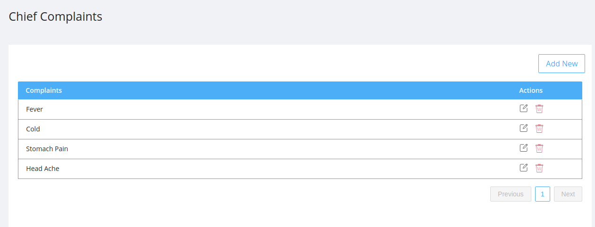

## Listing

Lists the chief complaints which appears as one of the field in the examination section in doctor screen to record the chief health issues of the patient.

- Each item in the table has a name and actions:

  - #### Edit:

    - On clicking the edit icon the edit modal will be opened.
    - The admin can edit the chief complaints .
    - The edit modal contains :

      - `Name` : It is the name of the chief complaint.
      - `Department` : It is the name of the department to which the compalint belongs.

      

  - #### Delete:

    - On Clicking the delete icon a confirmation modal will be displayed before deleting the chief complaint permanently.
    - After confirming the delete action the deleted chief complaint will no longer be displayed in the application.

    

## Create New Chief Complaint

On clicking the `Add New` button a modal will be opened with same [fields](#fields) as the edit modal.

