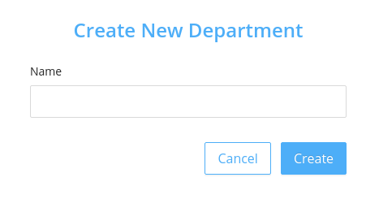

Displays the departments in a hospital.

### Listing the Departments

Department section initially displays all departments.

### Create New Department

New department can be added by clicking the  <code>New Department</code>.

Create Department modal has a single field:

- <code>Name</code> which is a text field to enter the name of new department.

### Edit Department

Existing department name can be edited by clicking edit icon. 

Update Department modal has a single field:

- <code>Name</code> which is a text field to change the name of department.

### Delete Department

Existing Department can be deleted by clicking delete icon. 

Delete Department modal is a confirmation dialog box to confirm deletion.

