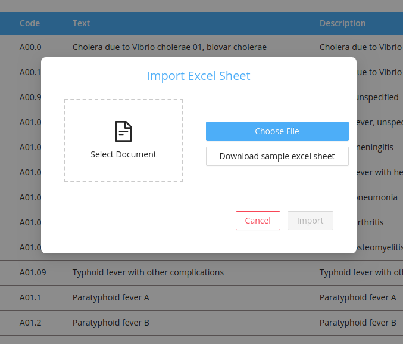
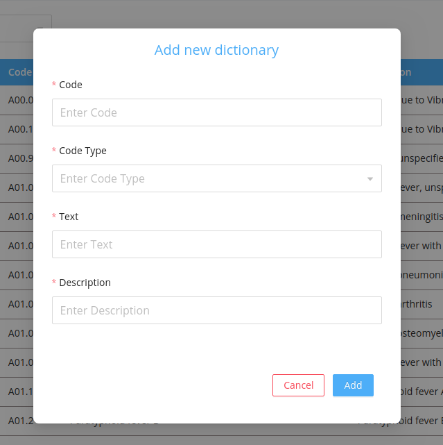
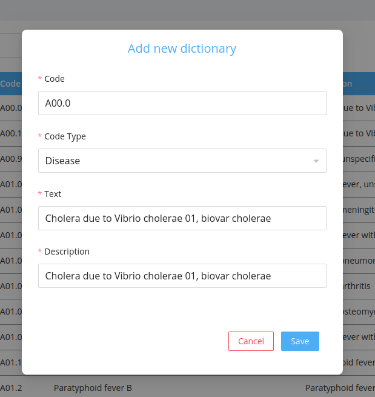
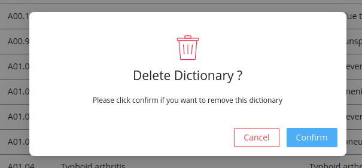
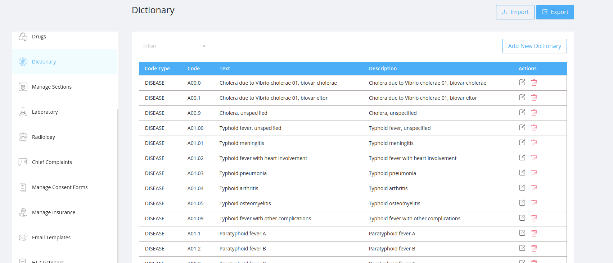
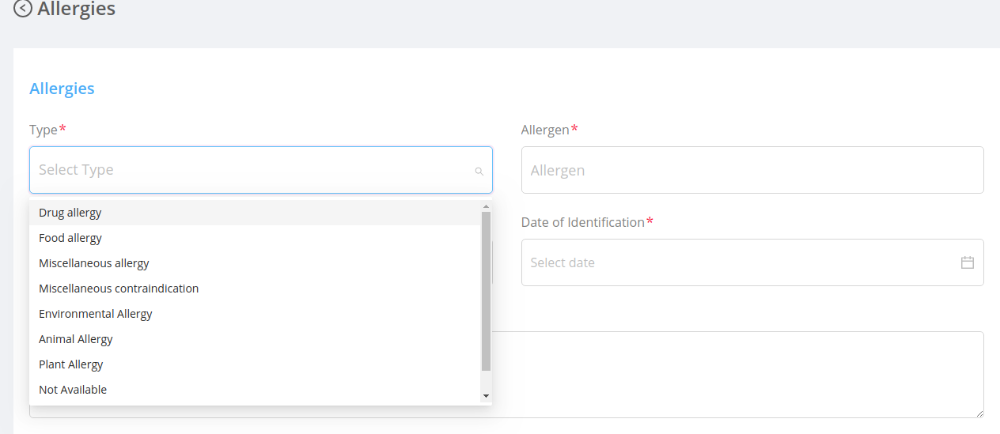

Dictionaries are the application meta datas which are used as the dropdowns through out the application like `disease` , `allergy` , `citizenship` , `email type` , `generic codes` , `citizenship` , `primary languages` , `specialities` etc..

## Export

- The default dictionary list can be exported by clicking on the `Export` button on the top.
- Downloaded file can be [imported](#Import) to get a default dictionary list.

## Import

- On clicking the `Import` button import modal will be opened.
- If the user wants to import a new dictionary list:
  - The admin can download the sample excel sheet by clicking the `Download the sample excelsheet` button.
  - Then prepare the new dictionary list similar to the sample excel sheet .
- Select the downloaded file from the device and click on `import` button in the modal.

## Create New Dictionary

User can create a new dictionary by adding the details

###### Fields

- `Code Type` : It is the type of application meta data.
- `Code` : It is the code of the meta datas ie the values which comes in the dropdowns in various screens.
- `Text` : While adding new dictionary the admin can add a text for the new dictionary.
- `Description` : Admin can add the description for the dictionary
- `Actions` : Two types of actions are available for each dictionary.

## Filtering

Dictionaries can be filtered based on the different dictionary types like `disease` , `allergy`, `citizenship` , `email type` , `generic codes` , `citizenship` , `primary languages` , `specialities` etc

## Listing

Dictionary section displays the list of dictionaries with each dictionary having information about [fields](#fields):

- #### Edit:

  - On clicking the edit icon the edit modal will be opened.
  - The admin can either edit the dictionary details and save it .
  - The edit modal contains the same [fields](#fields) displayed in the table.
    

- #### Delete:

  It deletes the dictionary permanently.

  - On Clicking the delete icon a confirmation modal will be displayed before deleting the dictionary permanently.
  - After confirming the delete action the deleted dictionary will no longer be displayed in the user table.

  

## UI Changes

The added dictionary will be used as the values for different dropdown.For example:

1. Login as doctor.
2. In the side bar click the allergies.
3. Inside the allergy section `Type` field dropdown values are of the type of dictionary `Allergy`

