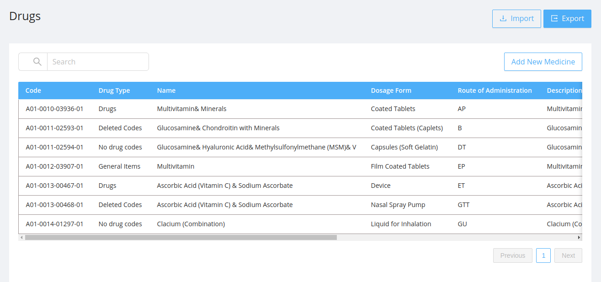
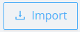
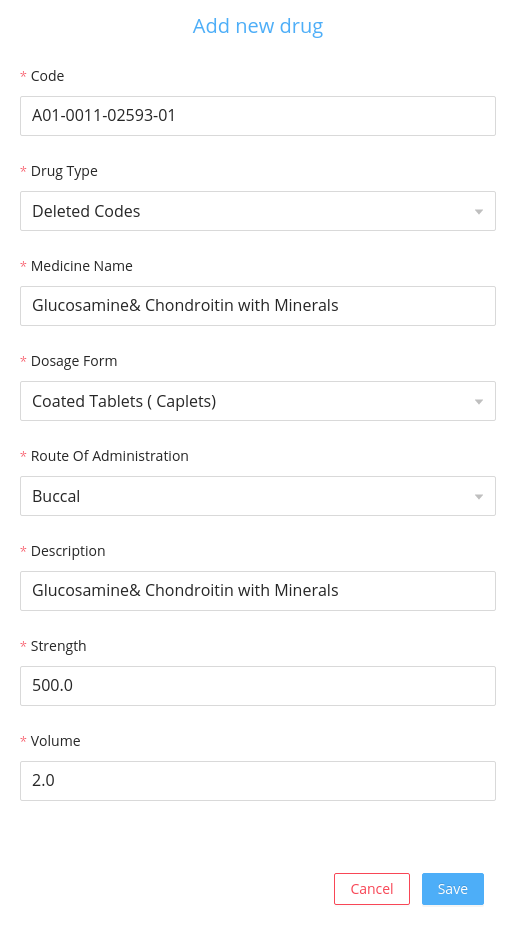

Drugs section allows the admin to upload the drugs which is prescribed by the doctor after examining the patient.

## Export

- The default drugs list can be exported by clicking on the `Export` button on the top.
- Downloaded file can be [imported](#Import) to get a default drugs list.

## Import

- On clicking the `Import` button import modal will be opened.
- If the user wants to import a new drugs list:
  - The admin can download the sample excel sheet by clicking the `Download the sample excelsheet` button.
  - Then prepare the new drugs list similar to the sample excel sheet .
- Select the downloaded file from the device and click on `import` button in the modal.
<!-- After exporting the default dictionary file `dictionary.xlsx` click on the `Import` button and select the downloaded file and -->

## Create New Drug

User can create a new drugs by adding the drug details in the modal displayed after clicking the `Create New Medicine`

###### Fields

- `Code` : It is the code of the meta datas ie the values which comes in the dropdowns in various screens.
- `Drug Type` : It is the type of application meta data.
- `Name` : While adding new drug the admin can add a text for the new drug.
- `Dosage Form` : It is the form in which the drug is available to the patients like `Coated Tablets`, `Capsules` etc...
- `Route Of Administration`: It is the route of administration of the drug.
- `Descriptions`: It is the drug description.
- `Strength` : It is the strength of the drug and it is numeric value.
- `Volume` : It is the volume of the drug in numerical value.
- `Created Date`: It is the date when the drug is added.
- `Actions` : Two types of actions are available for each drug.

## Searching

Drugs can be searched based on the drug code.

## Listing

Drugs section displays the list of drugs with each drug having information about [fields](#fields):

- #### Edit:

  - On clicking the edit icon the edit modal will be opened.
  - The admin can either edit the drug details and save it .
  - The edit modal contains the same [fields](#fields) displayed in the table.

- #### Delete:

  It deletes the user permanently.

  - On Clicking the delete icon a confirmation modal will be displayed before deleting the drug permanently.
  - After confirming the delete action the deleted drug will no longer be displayed in the user table.

## UI Change

The changes made in drugs gets reflected in the doctor screen in Medical history section as:

The changes made in drugs gets reflected in the doctor screen in Prescriptions section as:

