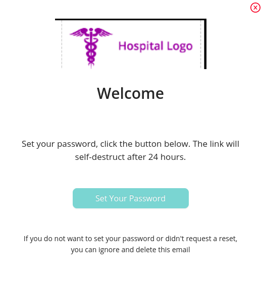
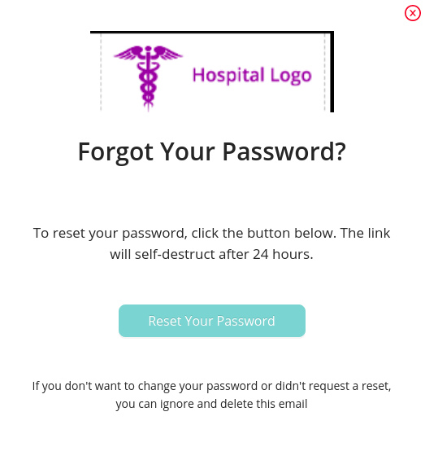

Email Template section is to send email preview to the users.This section consists of 2 email templates:

- ### New User Template

  This email template preview is send to user when the receptionist book a slot for a patient.

  ##### Fields

  - `Subject` : It is the subject of the email send to user.
  - `Header` : It is the header content which is followed by patient name.
  - `Message` : It is the message which is shown under the header section in the email preview.
  - `Button Name` : It is the content to be displayed on the button.
  - `Footer` : It is the footer portion of the email preview.

  Preview option is available for displaying sample preview of the New User Template.
  

  Once a slot is booked for a patient by receptionist, the email template send to user is as follows:
  

- ### Reset Password Template

  This reset password template preview is send to user when the receptionist request for resetting the password.
  It contains the same [fields](#fields) as of the New User Template .

  Preview option is available for displaying sample preview of the Reset Password Template.

  
