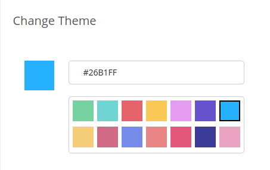
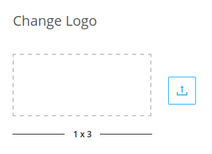
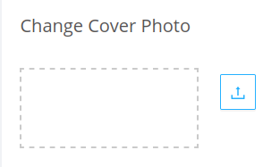
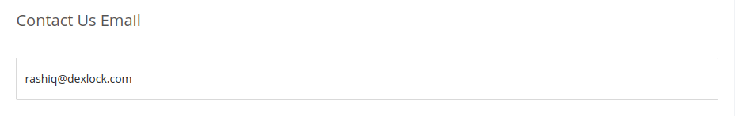
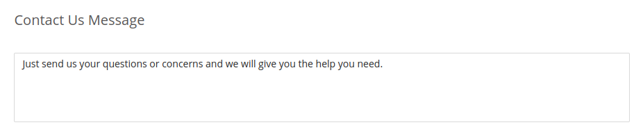

This option gives the admin the ability to change the logo, theme, cover photo and set the email
to which the user can contact along with a message.

#### Changing Theme

A 14 colour palette is provided to the admin from which the admin can choose which colour has to be set as the theme colour of the application.

#### Changing Logo

The admin has the option to upload logo of the origanization for which the application is for and this logo will be set as the default logo. So where ever logo is being displayed in the application, the logo which was set by the admin will be displayed. The logo size must be in the ratio 1:3.

#### Changing Cover Photo

This option allows the admin to set the cover picture which is displayed in the front page of the main webpage.

#### Setting Contact Email

This allows the admin to set the email to which users can send mail inorder to communicate with his organization.

#### Setting Contact Messages

This allows the admin to set a message in the contact section.

<!-- This is a link to [another document.](doc3.md) This is a link to an [external page.](http://www.example.com/) -->
