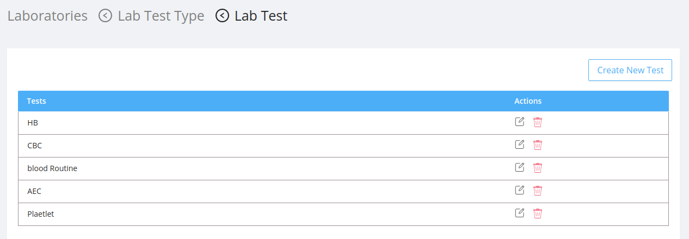

Laboratory section deals with the lab tests available for the patient.

## Listing The Specimens

- This section lists the specimens which the patient needs to be tested.

- The table contains:

  - `Types` : It is the name of the specimen.
  - `Actions` : It includes generally three main functions :

    - #### Manage Test Type
      - It includes the list of chemical components of the specimen which needs to be tested.
      <!--  -->
    - #### Edit

      - On clicking the edit icon the edit modal will be opened.
      - The admin can either edit the specimen name in the `Type` field and save it .
      

    - #### Delete
      - On Clicking the delete icon a confirmation modal will be displayed before deleting the specimen permanently.
      - After confirming the delete action the deleted specimen will no longer be availble for testing.
      

  

## Create New Specimen

- Click on the `New Type` button
- In the modal add the name of the new specimen in the `Type` field.
- Click on the `Save` button to add the new specimen.

## Listing The Chemical Components

- This section lists the chemical components of the specimen which needs to be tested.

- The table contains:

  - `Test Types` : It is the name of the chemical componnet of the selected specimen.
  - `Actions` : It includes generally three main functions :

    - #### Manage Tests
      - It includes the list of chemical components of the specimen which needs to be tested.
    - #### Edit

      - On clicking the edit icon the edit modal will be opened.
      - The admin can either edit the chemical component name in the `Type` field and save it .
      

    - #### Delete
      - On Clicking the delete icon a confirmation modal will be displayed before deleting the chemical component of the specimen permanently.
      - After confirming the delete action the deleted the chemical component of the specimen will no longer be availble for testing.
      
  
  

## Create New Chemical Component for the specimen

- Click on the `New Test Type` button
- In the modal add the name of the new chemical component of the specimen in the `Type` field.
- Click on the `Save` button to add the new specimen.

## Listing the Tests

- This section displays the list of currently available tests.

- The table contains:

  - `Tests` : It is the name of the chemical componnet of the selected specimen.
  - `Actions` : It includes generally three main functions :

    - #### Edit

      - On clicking the edit icon the edit modal will be opened.
      - The admin can either edit the test name in the `Type` field and save it .
      

    - #### Delete
      - On Clicking the delete icon a confirmation modal will be displayed before deleting the test permanently.
      - After confirming the delete action the test will no longer be availble.
      

## Create New Test

- Click on the `Create New Test` button
- In the modal add the name of the new chemical component of the specimen in the `Type` field.
- Click on the `Save` button to add the new specimen.

## UI Change

Steps to be followed in the Doctor screen are:

- Select Specimen from the `Type` field.
- Then select the Chemical Component from the `Test` field.

The resulting doctor screen is as follows:
