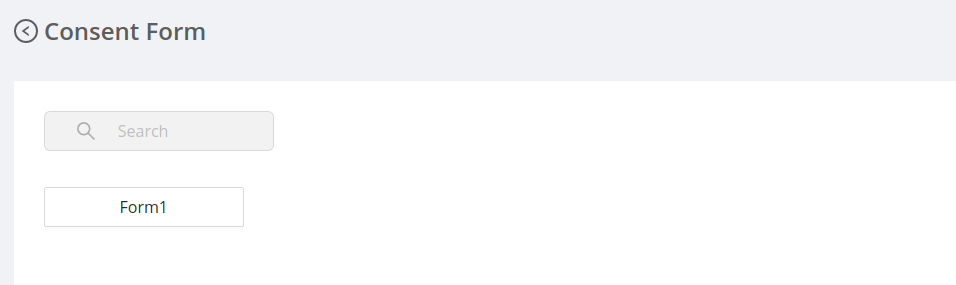

Manage Consent Form section displays the list of consent forms in a table.

### Consent Form Details

Consent form details include:

- Form Name : It is the name of the consent form.
- Departments : It denotes the department to which the consent form is applicable.
- Created Date : It is the date when the consent form was created.
- Actions : It includes three actions: 
    - #### Download 
        It allows to download the consent form.
    - #### Edit
        It allows the admin to edit the consent form. The admin can edit the following fields of the consent form:
         - `Form Name` , `Department` , `Consent Form`
    
        
    
    - #### Delete
        It deletes the consent form permanently.
        - On Clicking the delete icon a confirmation modal will be displayed before deleting the consent form permanently.
        - After confirming the delete action the consent form will no longer be available in table.

        

### Create New Consent Form

New consent form can be uploaded by clicking the <code>Create Consent Form</code>.

Create Consent Form modal have basically three fields:

- <code>Form Name</code> which is a text field to enter the name of the consent form.
- <code>Department</code> which is a dropdown to select the department.
- <code>Upload Consent Form</code> which is a drag and drop field to upload the consent form.

### UI Change

- Once the consent form is uploaded, the nurse will be able to access it depending on for which department that form is meant for, when a patient visits a doctor in that particular department.

