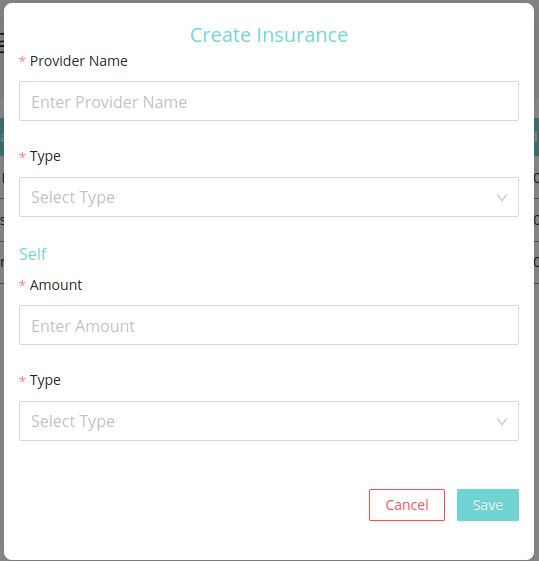
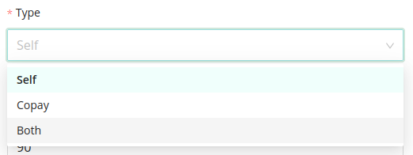

This option gives the admin to add a new insurance scheme as well as update and delete an existing insurance scheme.

## Create Insurance

- Admin can add a new insurance scheme.

- It contains the following fields:
    - `Provider Name` : Name of the company providing the insurance.
    - `Type` : Type of the insurance being taken. 
        - There are 3 choices: `self`,`copay`,`both` 

    - `Amount` : The bill amount of the patient to which the insurance is covered.
    - `Type` : There are 2 options.
        - There are 2 options: `Percentage` , `Fixed Amount`

## Edit existing insurance

- Admin can edit/update an already existing insurance scheme details. 
- All fields which was mentioned earlier can be updated by the admin.

