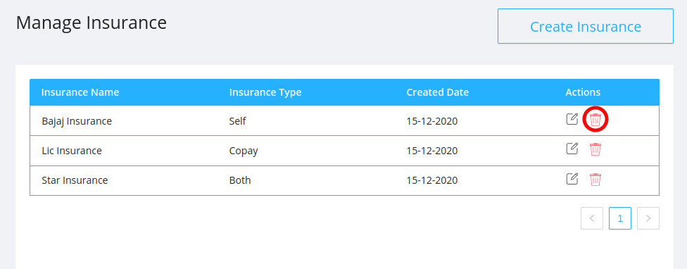

This option gives the admin to add a new insurance scheme as well as update and delete an existing insurance scheme.

## Create Insurance

- Admin can add a new insurance scheme.
  
- It contains the following fields:

  - `Provider Name` : Name of the company providing the insurance.
  - `Type` : Type of the insurance being taken.

    - There are 3 choices: `self` , `copay` , `both`.

    

  - `Amount` : The bill amount of the patient to which the insurance is covered.
  - `Type` : There are 2 options.
    - There are 2 options: `Percentage` , `Fixed Amount`.
    
      

- Once the insurance is created, it will be visible to the receptionist during instances like :

  - A patient books an appointment and in his payment type section, if the payment method is via insurance, then all available insurance providers details can be seen.
    

  - This information that a patient with a policy has taken an appointment will be visible to the person dealing with the insurance dealings.
    
  - If he accepts the claim, then the bill amount of the patient will be deducted from the sum insured by the policy.
  - The remaining amount will have to be paid by the patient.

## Edit Existing Insurance

- Admin can edit/update an already existing insurance scheme details.
- All fields which was mentioned earlier can be updated by the admin.
- Edit option can be found in the right side of all available insuarnce policies in the admin page.
  

  ## Delete Existing Insurance

  - Admin can delete an already existing insurance scheme.

  

  
