These are the sections which will be displayed in the side bar of different screens based on the roles and permissions.

## Listing Sections

Manage section contains a table with each row having .

- `Name` : It is the name of the section which will appear in the user screen.
- `Manage Forms` button : It is used to add new sub sections in the section

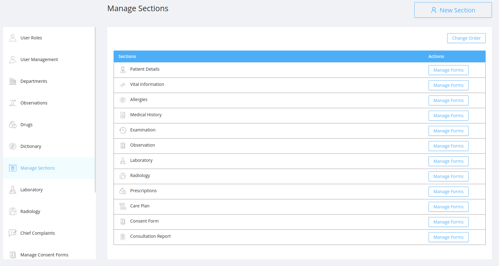

#### Change The Section Order

- Click on the `Change Order` button.
- Change the order as per the requirement by dragging.
- click on `Save Order`.

## Create New Section

On clicking the `New Section` button a modal will be opened which contains:

- `Name` : It is the name of the new section.
- `Icon` : It is the icon for the new section which will appear at the left side of the section name in the user screen.
- `Status` : It is the status of the section to determine whether the section shoul be dispalyed in the user screen or not.

## Listing Sub Sections

These are the list of sub sections availble for the selected section.It Contains:

- `Name` : It is the name of the sub section which will appear inside the section in user screen.
- `Manage Fields` button : It is used to add new fields in the selected section.

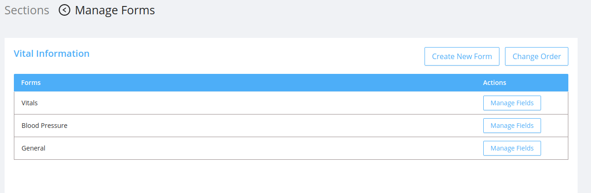

#### Change The Sub Section Order

- Click on the `Change Order` button.
- Change the order as per the requirement by dragging.
- click on `Save Order`.

## Create New Sub Section

On clicking the `Create New Form` button a modal will be opened which contains:

- `Name` : It is the name of the new sub section of the selected section.

## Listing Fields

These are the list of sub sections available for the selected section.It Contains:

- `Fields` : It is the name of the sub section which will appear inside the section in user screen.
- `Type` : It is the type of the field like `input text`, `input number`, `dropdown`, `radio button`, `text area`
- `Mandatory` : It is a checkbox to record whether the field is mandatory or not.
- `Input Box Size` :It allows the user to choose the size of the input box from the options.
  - `Full Width` : On selecting the full width the field occupies the full width of the form container.
  - `Half width` : On selecting the half width the field occupies the half width of the form container.
- `Actions` : Each field has two actions:

  - #### Edit:

    - On clicking the edit icon the edit modal will be opened.
    - The admin can edit the field details .
    - The edit modal contains :

      - `Name` : It is the name of the new sub section of the selected section.

      - `Type` : It is the type of the field like `input text`, `input number`, `dropdown`, `radio button`, `text area`
      - `Mandatory` : It is a checkbox to record whether the field is mandatory or not.
      - `Input Box Size` :It allows the user to choose the size of the input box from the options.

        - `Full Width` : On selecting the full width the field occupies the full width of the form container.
        - `Half width` : On selecting the half width the field occupies the half width of the form container.

  - #### Delete:

    - On clicking the delete icon a confirmation modal will be displayed before deleting the field permanently.
    - After confirming the delete action the deleted field will no longer be displayed in the section.

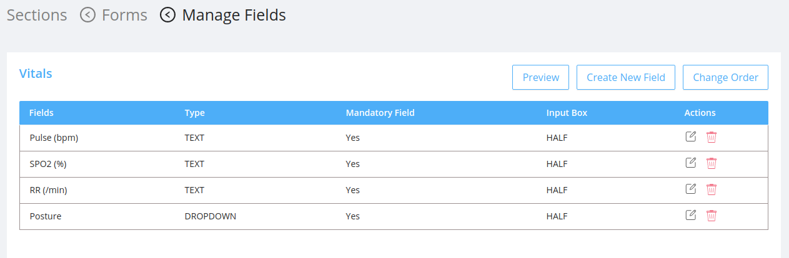

#### Change the Field Order

- Click on the `Change Order` button.
- Change the order as per the requirement by dragging.
- click on `Save Order`.

#### Preview of the Fields

- On clicking the preview button in the `Sections` <- `Forms` <- `Manage Fields` page preview modal will be diplayed.
- The modal contains the all the fields of the selected sub section.

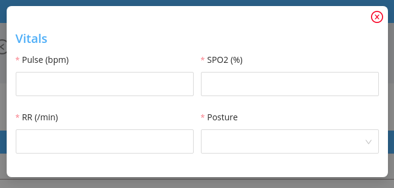

## Create New Field

On clicking the `Create New Field` button a modal will be opened which contains [field](#fields) details.

## UI Changes

The sections added wil be displayed in the respective user screen.For example

1. Add a new section by clicking on the `New Section`Button

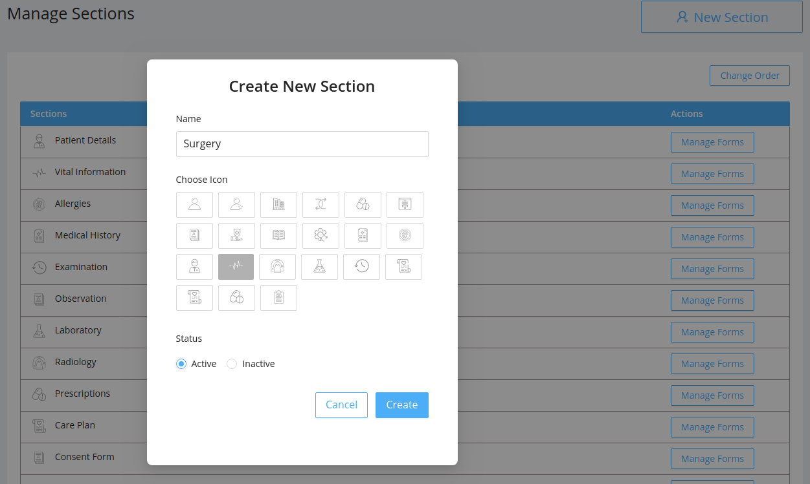

2. Go to `User Roles` section in the side bar.

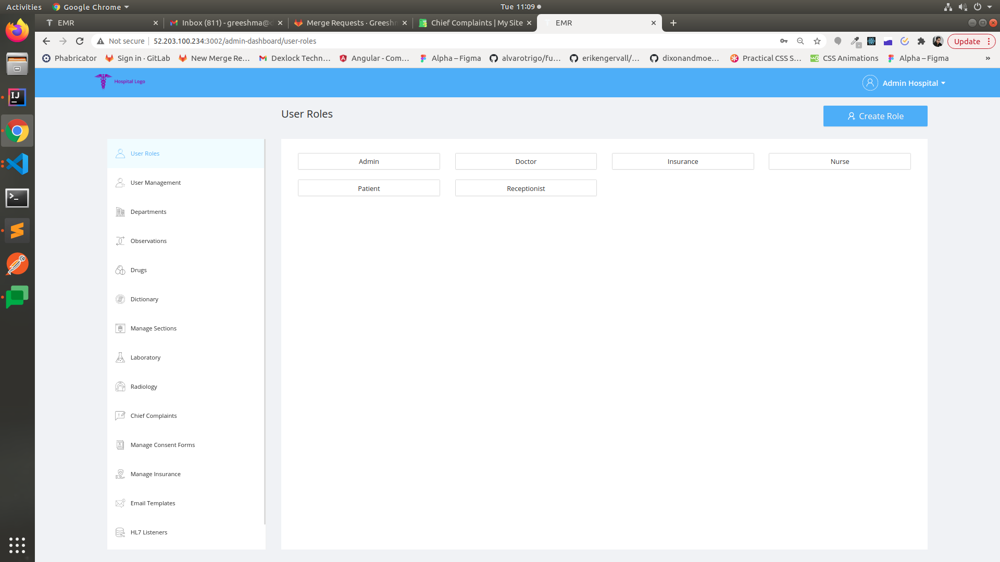

3. Select a user role.For example select `Doctor`.

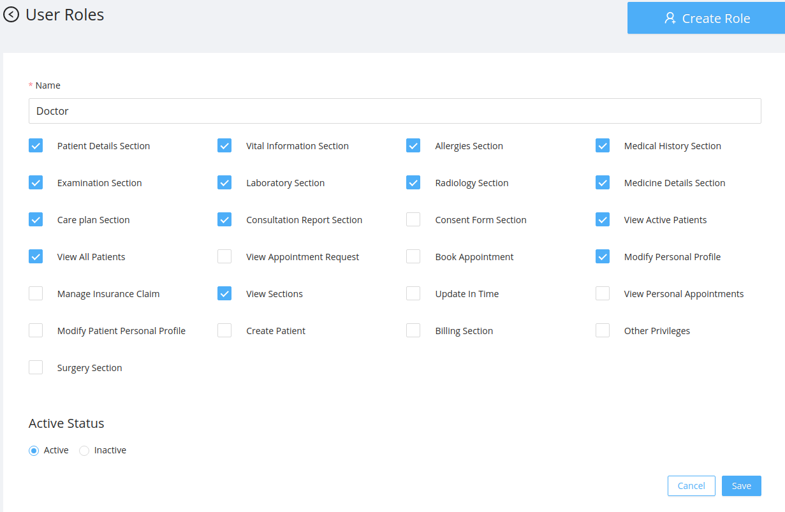

4.The newly added `Surgery Section` will be dispalyed in the permissions list.

5. Enable the permission for the new section in the doctor screen .

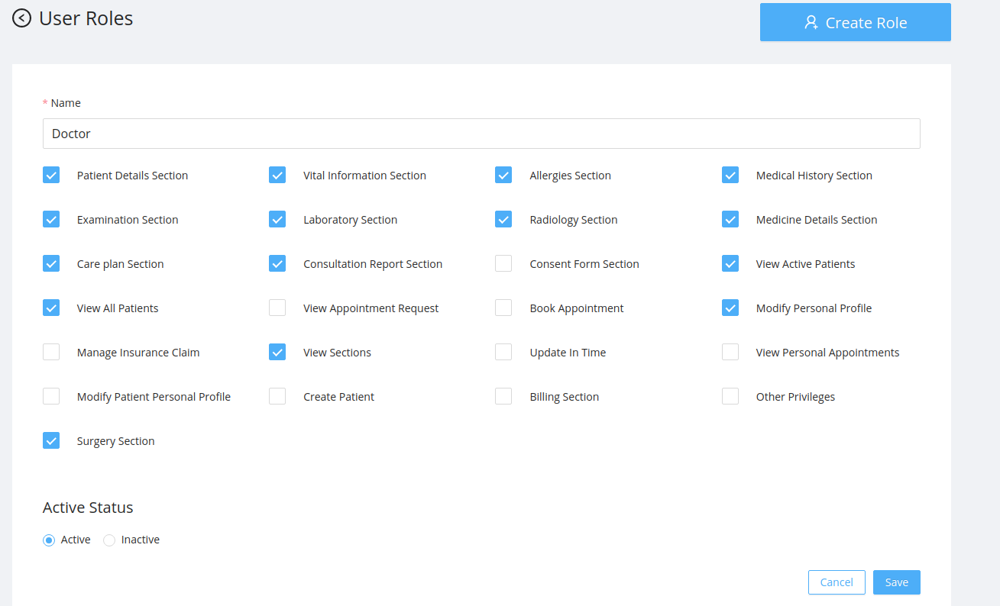

6. On saving the permission for the new section a success modal will be displayed.

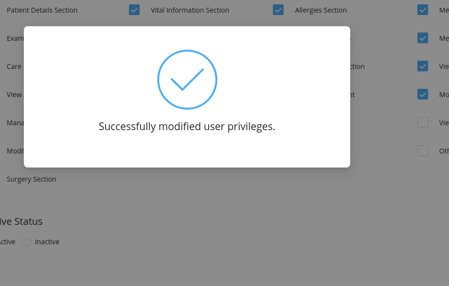

7. Go to Doctor Screen inorder to view the new section in the side bar and click on the `Surgery`

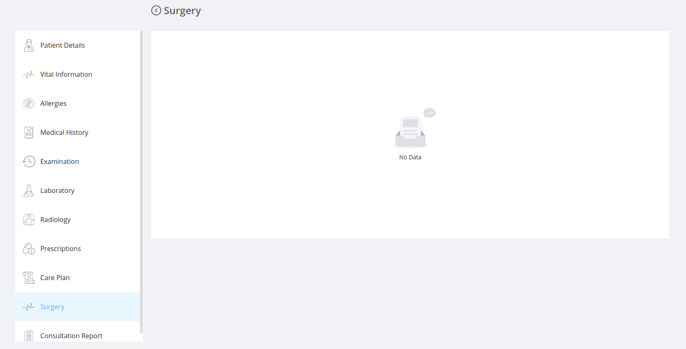

The surgery screen will be empty until it is been configured by the admin.

8. Go to admin screen and click on `Manage Sections` to configure the new section.

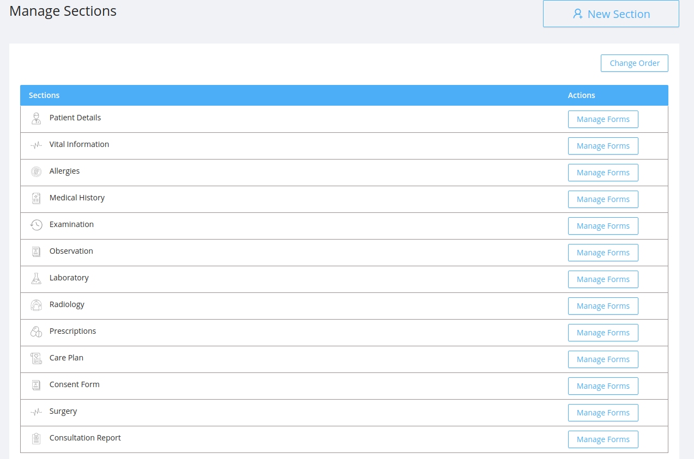

9. Click on the `Manage Forms` at the right end of the surgery section in the list.

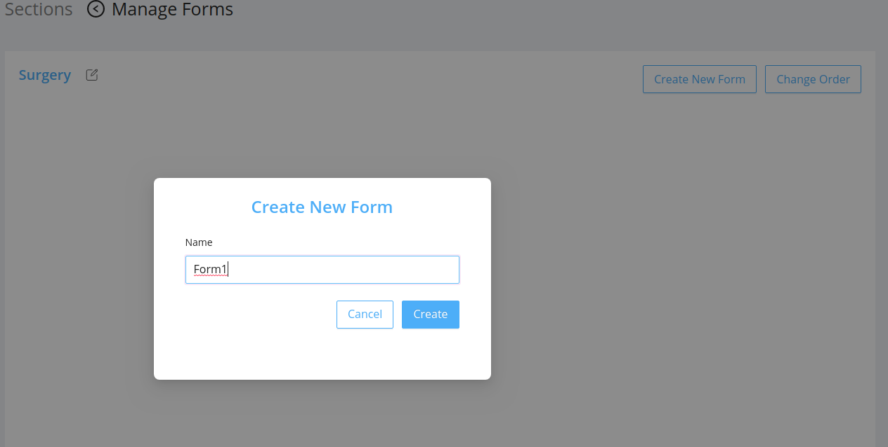

10. Click on the `Create New form` in the Sections <- Manage Forms and add a form `Form1`

11. The newly added form name will be displayed inside the Sections <- Manage Forms page

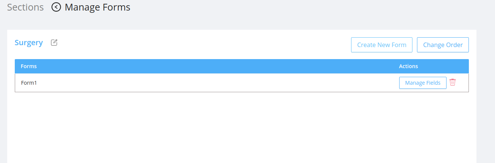

12. Click on the `Manage Fields` button in the Sections <- Manage Forms page against the newly added form `Form1`

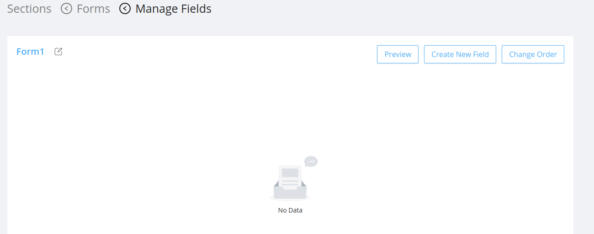

13.In Sections <- Manage Forms <- Manage Fields click on the `Create New Field` button.

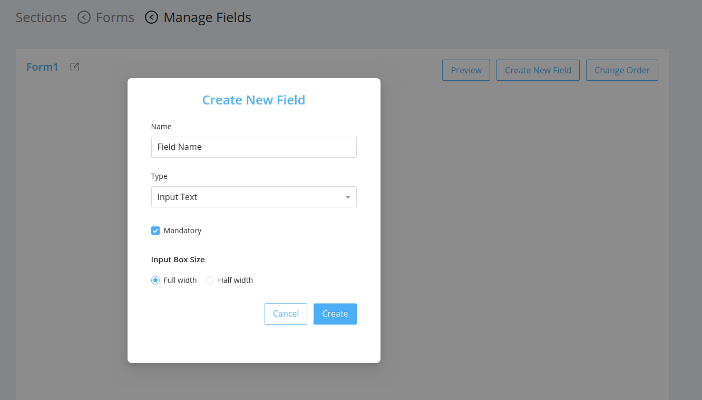

14. Newly added field inside the `Form1` will be listed in the Sections <- Manage Forms <- Manage Fields page

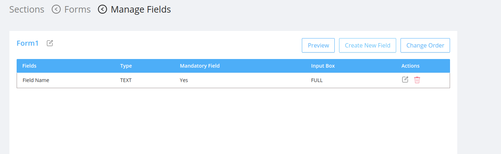

15.CLick on the `Preview` button to see the preview of the form `Form1`.

16. Final Doctor screen will be

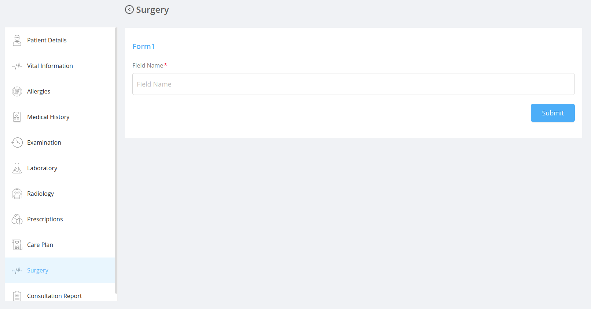

<!-- The `Vital Information` section has different sub section like `vitals`, `Blood Pressure` etc with each sub section having different fields in it.

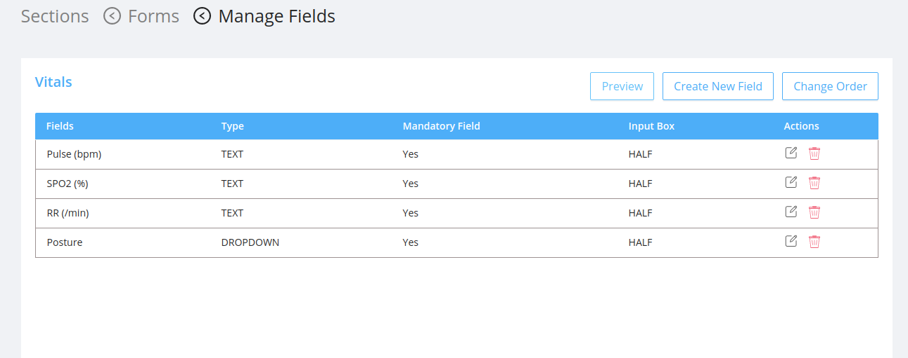 -->
