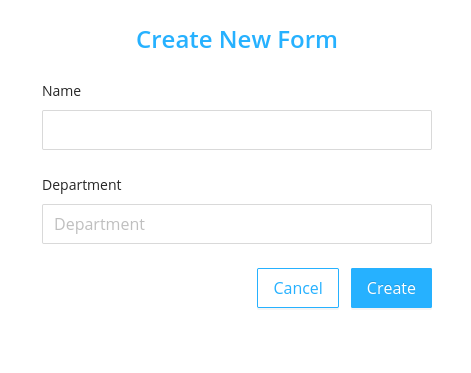
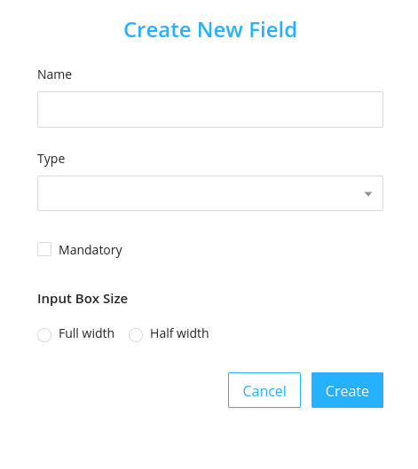
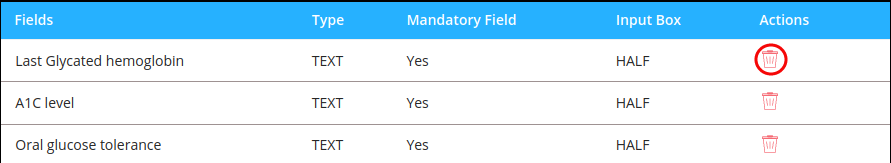
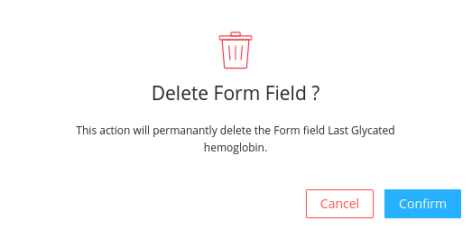
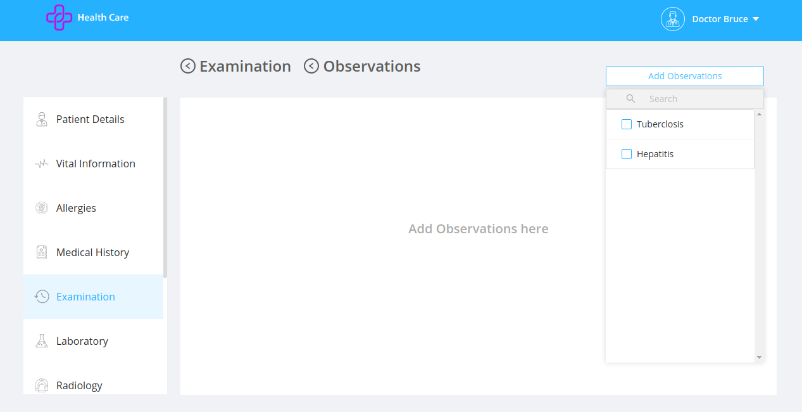

These are the observations about the patient added by the doctor in the examination section after submitting the examinations fields.

## Listing

This screen lists different observation items called forms.Each form item has different fields.

## Create Observation Form

- Click on the `Create New Form` button.
- It opens a modal having fields:
  - `Name`: It is an input text field to enter the form name.
  - `Department`: It is a dropdown with department names as the values.
- Each form has different fields which can be created by clicking on `Manage fields` and then further clicking the [Create New Field](#create-observation-fields)

## Create Observation Fields

- Clicking on the `Create New Field` in the manage field section inside observations opens a modal.
- The modal contains fields:
  - `Name` : It is the name used to identify the field
  - `Type` : It is the type of the field like drop down ,text area ,input text,radio button, date picker,input number
  - `Mandatory` : It is a checkbox to record whether the field is mandatory or not.
  - `Input Box Size` :It allows the user to choose the size of the input box from the options.
    - `Full Width` : On selecting the full width the field occupies the full width of the form conatiner.
    - `Half width` : On selecting the half width the field occupies the half width of the form conatiner.

    

## Delete Observation Fields

It deletes the field permanently.

- On Clicking the delete icon a confirmation modal will be displayed before deleting the field permanently.
- After confirming the delete action the deleted field will no longer be displayed in the `Manage Fields` sub section in the observation.

## UI Change

The added observation gets reflected in the doctor screen as:

