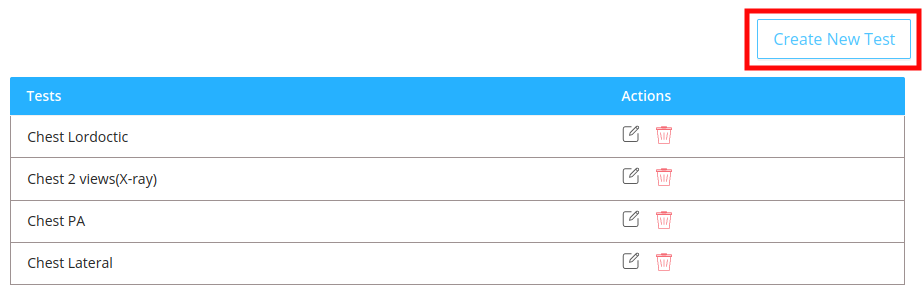

Radiology section deals with the radiology tests available for the patient.

## Listing the specimens

- This section lists the human body parts which is scanned to identify and monitor certain diseases.
- The table contains:

  - `Human Body Part`: It is the name of the specimen.
  - `Actions`: It includes generally three main functions :

    - #### Manage Test Type
      - It includes the list of different type of imaging technologies available for a particular human body part.
    - #### Edit

      - On clicking the edit icon the edit modal will be opened.
      - The admin can either edit the name of the body part in the `Type` field and save it .

    - #### Delete
      - On Clicking the delete icon a confirmation modal will be displayed before deleting the scan type permanently.
      - After confirming the delete action no scanning test will be availble for the deleted body part.

    

## Create New Human Body Part

- Click on the `New Type` button
- In the modal add the name of the human body part in the `Type` field.
- Click on the `Create` button to add the new human body part.

## Listing The Imaging Technologies

- This section lists the different type of imaging technologies available for the selected human body part.

- The table contains:

  - `Test Types`: It is the name of the scan.
  - `Actions`: It includes generally three main functions :

    - #### Manage Tests
      - It includes the list of different type of imaging technologies .

      

    - #### Edit

      - On clicking the edit icon the edit modal will be opened.
      - The admin can either edit the imaging technology name in the `Type` field and save it .

  
      

    - #### Delete
      - On Clicking the delete icon a confirmation modal will be displayed before deleting the imaging technology permanently.
      - After confirming the delete action the deleted imaging technology will no longer be availble .

      

    
## Create New Imaging Technology

- Click on the `New Test Type` button
- In the modal add the name of the new imaging technology in the `Type` field.
- Click on the `Create` button to add the new imaging technology.

## Listing the Imaging Tests

- This section displays the list of imaging tests.

- The table contains:

  - `Tests`: It is the name of the imaging test of the selected specimen.
  - `Actions`: It includes generally three main functions :

    - #### Edit

      - On clicking the edit icon the edit modal will be opened.
      - The admin can either edit the test name in the `Type` field and save it .

    

    - #### Delete
      - On Clicking the delete icon a confirmation modal will be displayed before deleting the test permanently.
      - After confirming the delete action the imaging test will no longer be availble.

    

## Create New Imaging Test

- Click on the `Create New Test` button.
- In the modal add the name of the new imaging test in the `Type` field.
- Click on the `Create` button to add the new imaging test.

## UI Changes

- The updations made by the admin in the radiology section will be visible to the doctor in his page under the radiology test section.

