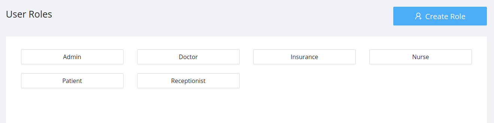
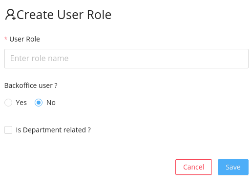

Displays the user roles,user permissions and status of the user which are necessary for accessing the functionalities provided by the application.

## Listing the roles

User roles section initially displays the list of user roles.

## Listing the Permissions and status

- On selecting any user roles the permissions associated with the user roles will be listed down.
- All the permisssions available for the selected user will be listed down which the admin can enable or disable.
- Admin can activate or deactivate the user role by selecting active or inactive buttons.
- All the changes will be reflected, only by clicking the save button.

## Create New User Role

New user can be added by clicking the <code>Create Role</code>.

Create User Role modal have basically three fields:

- <code> User role name</code> which is a text field to enter the the name of the user role.
- <code>Backoffice User </code> which is a radio button accepting yes or no values.
- <code> Is Department Related</code> which is a checkbox to record whether the new user role is related to any department or not.

